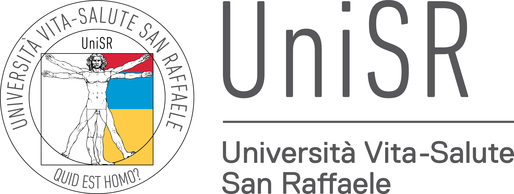

  

  

  

# UXAI Medical Glossary

Welcome to the glossary supporting the **UXAI – Medical LLM Confidence Project**.
This site hosts the **UXAI Medical Glossary** and related materials.  
It is designed to support:

- research on **LLM confidence** and **uncertainty**;
- **XAI (explainable AI)** in clinical and medical settings.

👉 To browse all terms, [Go to the Glossary](./glossary.html)

---

## What you’ll find in this glossary

- Definitions of key concepts in **LLM confidence**, **uncertainty**, and **XAI**;  
- Clinical vs. AI model differences in confidence;
- Acronyms and variants (e.g., CI, CoT, LLM API…).  

Each term is linkable directly via anchors, and your Google Docs are automatically connected to these definitions.

The glossary entries are:

- precise enough for technical readers;
- readable enough for teaching and cross-disciplinary work;
- stable and linkable, so they can be referenced from Google Docs or other documents.

👉 To see how to propose new terms or use the glossary in Google Docs, see **[Contribute](./contribute.html)**.
